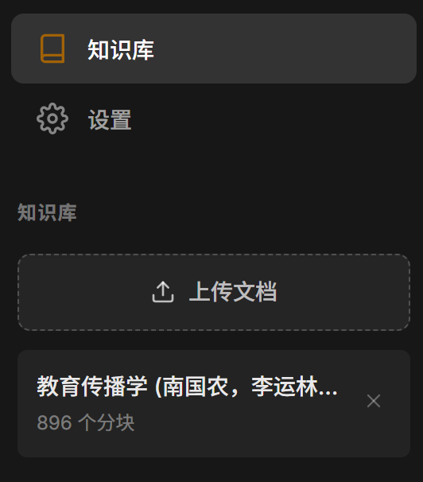
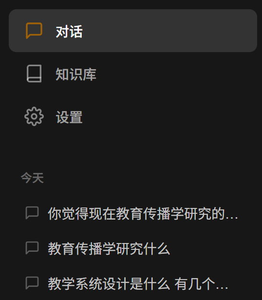

<div align="center">

#   EduLocal Agent

### 桌面级智能教学助理 —— 每个师生都值得拥有的 AI 助教

[](https://python.org)
[](https://fastapi.tiangolo.com)
[](https://langchain-ai.github.io/langgraph)
[](https://vuejs.org)
[](LICENSE)


</div>

---

##   项目简介

EduLocal Agent 是一款**完全本地化运行**的智能教学助理，融合了 **Multi-Agent 协作 + RAG 检索增强 + LangGraph 状态机** 等前沿 AI 技术，为教师和学生提供：

-   **知识答疑** —— 基于上传教材的精准问答
-   **习题生成** —— 自动生成多类型练习题
-   **学习规划** —— 个性化学习路径推荐
-   **学情分析** —— 薄弱点诊断与学习建议

### 为什么选择 EduLocal？

| 特性 | EduLocal Agent | 传统 AI 助手 |
|------|----------------|--------------|
| **数据隐私** | ✅ 完全本地存储，数据不出电脑 | ❌ 数据上传云端 |
| **离线使用** | ✅ 支持 Ollama 本地模型 | ❌ 必须联网 |
| **专业知识** | ✅ 基于教材 RAG 检索 | ❌ 通用知识 |
| **安装难度** | ✅ 双击即用，零配置 | ❌ 需要服务器 |
| **多 Agent 协作** | ✅ 智能路由，专业分工 | ❌ 单一对话 |

---

##   功能展示

<div align="center">

<br>
<em>基于 RAG 的智能对话答疑</em>
</div>

<div align="center">

<br>
<em>知识库文档管理</em>
</div>

<div align="center">

<br>
<em>模型配置与切换</em>
</div>

<div align="center">

<br>
<em>历史会话管理</em>
</div>

---

##   功能模块

###   智能对话答疑
基于 RAG（检索增强生成）技术，上传教材后即可获得**带引用来源**的精准回答。

###   习题生成
输入知识点和难度，自动生成**选择题、填空题、判断题、简答题**，附带答案解析。

###   学习路径规划
根据学生水平和目标，生成**分步骤、可执行**的个性化学习计划。

###   学情诊断分析
分析历史问答和测验数据，识别**薄弱知识点**，给出针对性学习建议。

###   知识库管理
支持 **PDF、Word、TXT、Markdown、HTML** 格式，自动向量化索引，增量更新。

---

##   技术架构

```
┌─────────────────────────────────────────────────────────────┐
│                      Frontend (Vue 3)                       │
│   Chat UI │ Knowledge Base │ Settings │ History Management  │
└─────────────────────────────────────────────────────────────┘
                              │
                              ▼
┌─────────────────────────────────────────────────────────────┐
│                    Backend (FastAPI)                         │
├─────────────────────────────────────────────────────────────┤
│                    LangGraph Workflow                        │
│  ┌──────────┐  ┌──────────┐  ┌──────────┐  ┌──────────┐   │
│  │Supervisor│→ │TutorAgent│  │Exercise  │  │ Analyst  │   │
│  │ (Router) │  │ (RAG)    │  │  Agent   │  │  Agent   │   │
│  └──────────┘  └──────────┘  └──────────┘  └──────────┘   │
├─────────────────────────────────────────────────────────────┤
│                      RAG Pipeline                           │
│  Document Loader → Text Splitter → ChromaDB → Hybrid Search│
├─────────────────────────────────────────────────────────────┤
│                    LLM Provider                              │
│     DeepSeek │ OpenAI │ Ollama (本地) │ 自定义 API          │
└─────────────────────────────────────────────────────────────┘
                              │
                              ▼
┌─────────────────────────────────────────────────────────────┐
│                      Data Storage                            │
│   SQLite (会话/学情) │ ChromaDB (向量) │ YAML (配置)       │
└─────────────────────────────────────────────────────────────┘
```

---

##  ️ 快速开始

### 环境要求

- Python 3.11+
- Node.js 18+ (前端开发)
- (可选) Ollama - 用于本地模型

### 安装步骤

**1. 克隆项目**
```bash
git clone https://github.com/your-username/EduLocal-Agent.git
cd EduLocal-Agent
```

**2. 安装后端依赖**
```bash
pip install -r requirements.txt
```

**3. 安装前端依赖**
```bash
cd frontend
npm install
cd ..
```

**4. 配置 API Key**
- 方式一：编辑 `configs/settings.yaml`
- 方式二：启动后在设置页面配置

**5. 启动服务**
```bash
# 启动后端
python -m backend.main

# 新终端，启动前端
cd frontend && npm run dev
```

**6. 访问应用**
打开浏览器访问 http://localhost:3000

---

##   配置说明

### settings.yaml

```yaml
llm:
  provider: "deepseek"        # deepseek / openai / ollama
  api_key: "sk-xxx"           # API Key
  model_name: "deepseek-chat" # 模型名称
  temperature: 0.7

embedding:
  provider: "local"
  model_name: "BAAI/bge-small-zh-v1.5"

rag:
  top_k: 5                    # 检索文档数量
  hybrid_weights: [0.6, 0.4]  # 语义/关键词权重
```

### 支持的 LLM 提供商

| 提供商 | 模型示例 | 说明 |
|--------|----------|------|
| DeepSeek | deepseek-chat, deepseek-reasoner | 性价比高，中文优秀 |
| OpenAI | gpt-4o, gpt-4o-mini | 功能强大 |
| Ollama | qwen2.5:7b, llama3 | 完全本地，隐私安全 |

---

##   项目结构

```
EduLocal-Agent/
├── backend/                  # 后端 Python 代码
│   ├── main.py              # FastAPI 入口
│   └── app/
│       ├── config/          # 配置管理
│       ├── models/          # 数据模型
│       │   ├── llm.py      # LLM 工厂
│       │   ├── embeddings.py
│       │   └── database.py
│       ├── rag/             # RAG 模块
│       │   ├── document_loader.py
│       │   ├── text_splitter.py
│       │   ├── vector_store.py
│       │   └── retriever.py
│       ├── agents/          # Agent 模块
│       │   ├── supervisor.py
│       │   ├── tutor.py
│       │   ├── exercise.py
│       │   ├── analyst.py
│       │   ├── planner.py
│       │   └── workflow.py
│       └── api/             # API 路由
├── frontend/                 # 前端 Vue 3
│   ├── src/
│   │   ├── views/
│   │   ├── components/
│   │   └── api/
│   └── package.json
├── configs/                  # 配置文件
│   └── settings.yaml
├── docs/                     # 文档
├── requirements.txt          # Python 依赖
└── README.md
```

---

##   核心技术亮点

### 1. LangGraph 状态机
使用 LangGraph 构建多 Agent 协作工作流，支持循环、分支、状态持久化。

### 2. 混合检索 + 重排序
- **语义检索**：BGE-small-zh 向量化，捕捉语义相似性
- **关键词检索**：BM25 算法，精确匹配关键词
- **RRF 融合**：加权融合两路结果，提升召回率

### 3. 流式输出
基于 SSE（Server-Sent Events）实现流式响应，用户体验更流畅。

### 4. 纯本地数据
所有数据存储在用户目录 `~/EduLocalData/`，支持完全离线使用。

---

##   路线图

- [x] 核心对话功能
- [x] RAG 知识库检索
- [x] 多 Agent 协作
- [x] 流式输出
- [x] 历史会话管理
- [ ] 学习路径可视化
- [ ] 知识图谱展示
- [ ] 多用户支持
- [ ] PyInstaller 打包

---

##   贡献

欢迎贡献代码、报告问题或提出建议！

1. Fork 项目
2. 创建特性分支 (`git checkout -b feature/AmazingFeature`)
3. 提交更改 (`git commit -m 'Add some AmazingFeature'`)
4. 推送到分支 (`git push origin feature/AmazingFeature`)
5. 创建 Pull Request

---

##   许可证

本项目采用 MIT 许可证 - 查看 [LICENSE](LICENSE) 文件了解详情

---

##   致谢

- [LangChain](https://github.com/langchain-ai/langchain) - AI 应用开发框架
- [LangGraph](https://github.com/langchain-ai/langgraph) - 状态机编排
- [ChromaDB](https://github.com/chroma-core/chroma) - 向量数据库
- [BAAI/bge-small-zh](https://huggingface.co/BAAI/bge-small-zh-v1.5) - 中文 Embedding
- [FastAPI](https://github.com/tiangolo/fastapi) - 高性能 Web 框架
- [Vue.js](https://github.com/vuejs/vue) - 渐进式 JavaScript 框架

---

<div align="center">

**如果这个项目对你有帮助，请给个 Star ⭐ 支持一下！**

Made with ❤️ for Education

</div>
