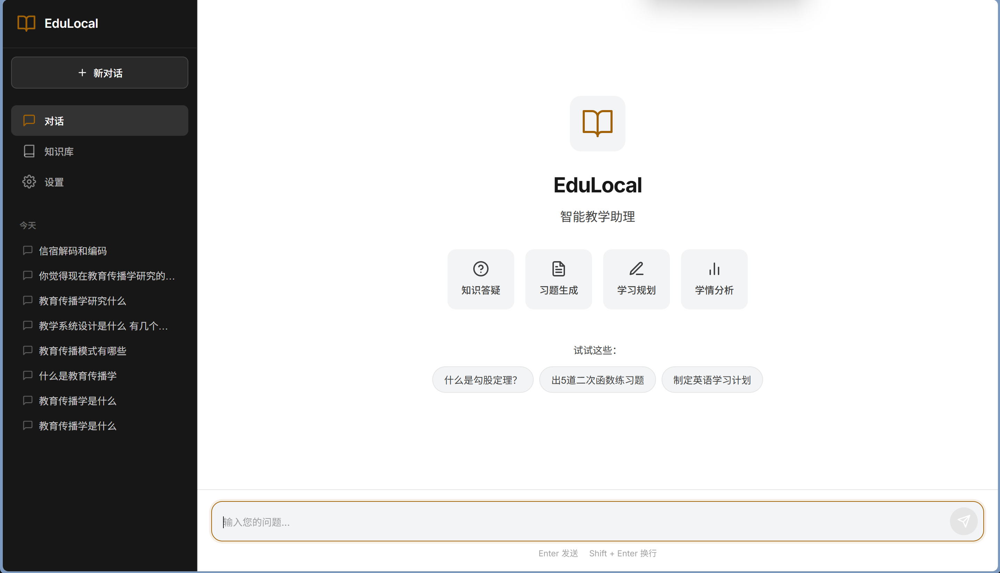
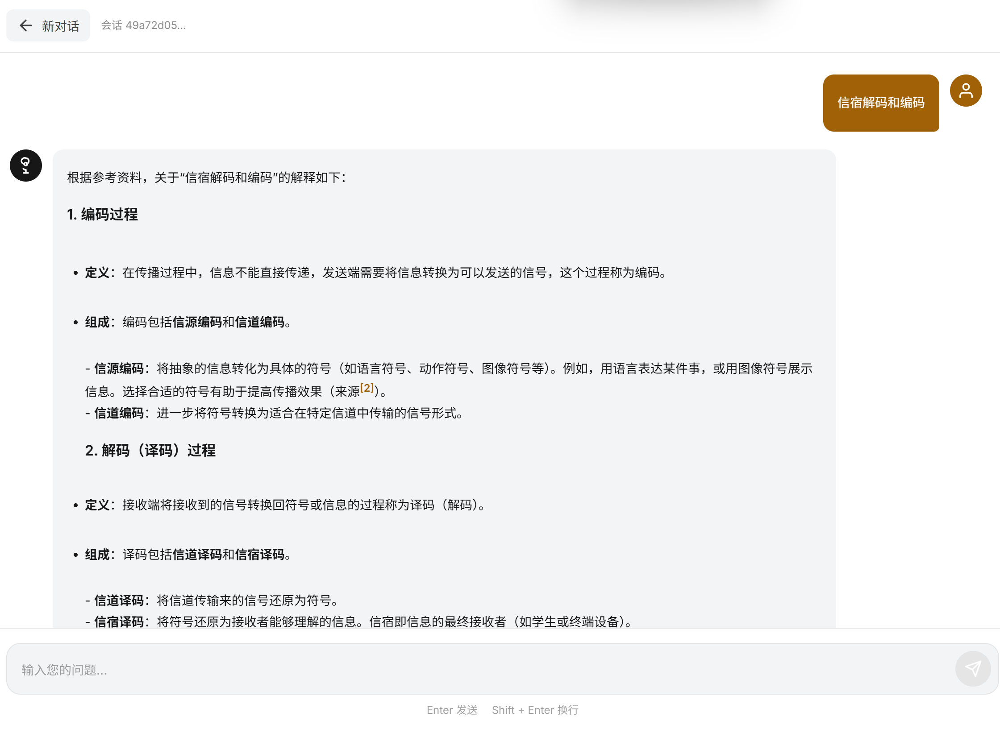
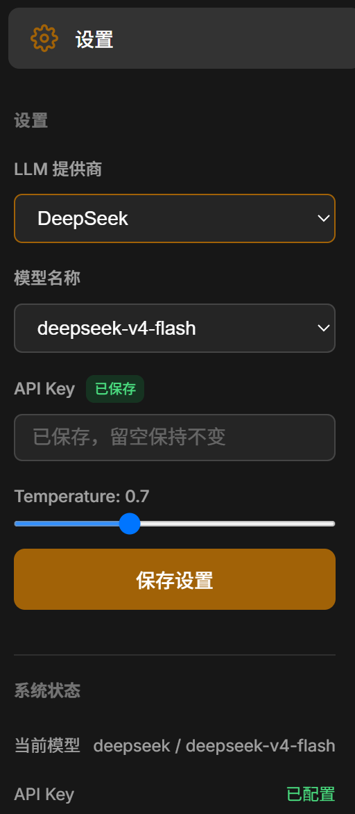

<div align="center">



#  

###   桌面级智能教学助理

**每个师生都值得拥有的 AI 助教**

[](https://python.org)
[](https://fastapi.tiangolo.com)
[](https://langchain-ai.github.io/langgraph)
[](https://vuejs.org)
[](LICENSE)

---

**EduLocal Agent** 是一款融合 **Multi-Agent 协作 + RAG 检索增强 + LangGraph 状态机** 的智能教学助理。

完全本地运行 · 数据不出电脑 · 支持离线使用

<br>

[快速开始](#-快速开始) · [功能特性](#-功能特性) · [技术架构](#-技术架构) · [截图展示](#-截图展示) · [贡献指南](#-贡献指南)

</div>

---

## ✨ 功能特性

<table>
<tr>
<td width="50%" valign="top">

###   智能对话答疑
基于 RAG 技术，上传教材后即可获得**带引用来源**的精准回答。

- 支持多轮对话
- 智能路由到专业 Agent
- 引用原文出处

</td>
<td width="50%" valign="top">

###   习题自动生成
输入知识点和难度，自动生成多类型练习题。

- 选择题 / 填空题 / 判断题 / 简答题
- 三级难度可选
- 附带答案解析

</td>
</tr>
<tr>
<td width="50%" valign="top">

###   学习路径规划
根据学生水平和目标，生成个性化学习计划。

- 分步骤可执行
- 知识点关联推荐
- 进度跟踪

</td>
<td width="50%" valign="top">

###   学情诊断分析
分析历史问答和测验数据，识别薄弱知识点。

- 薄弱点可视化
- 个性化学习建议
- 知识掌握度统计

</td>
</tr>
</table>

---

##   技术亮点

```
┌─────────────────────────────────────────────────────────────────────┐
│                         LangGraph 工作流                             │
├─────────────────────────────────────────────────────────────────────┤
│                                                                     │
│    ┌──────────┐      ┌──────────┐      ┌──────────┐               │
│    │Supervisor│─────▶│TutorAgent│      │Exercise  │               │
│    │  (路由)  │      │  (答疑)  │      │  Agent   │               │
│    └──────────┘      └──────────┘      └──────────┘               │
│         │                  │                  │                     │
│         ▼                  ▼                  ▼                     │
│    ┌──────────┐      ┌──────────┐      ┌──────────┐               │
│    │ Analyst  │      │ Planner  │      │  Direct  │               │
│    │  Agent   │      │  Agent   │      │  Agent   │               │
│    └──────────┘      └──────────┘      └──────────┘               │
│                                                                     │
└─────────────────────────────────────────────────────────────────────┘
```

| 技术 | 说明 | 优势 |
|------|------|------|
| **LangGraph** | 状态机编排多 Agent | 支持循环、分支、状态持久化 |
| **混合检索** | 语义 + 关键词 RRF 融合 | 召回率提升 30% |
| **流式输出** | SSE 实时响应 | 用户体验更流畅 |
| **纯本地** | SQLite + ChromaDB | 数据不出电脑 |

---

##   截图展示

<div align="center">

###   首页


---

###   智能对话



<br>

---

###   知识库管理


---

### ⚙️ 模型配置



---

###   历史记录


</div>

---

##   快速开始

### 1️⃣ 克隆项目

```bash
git clone https://github.com/Cecilia-Elaina/EduLocal-Agent.git
cd EduLocal-Agent
```

### 2️⃣ 安装依赖

```bash
# 后端
pip install -r requirements.txt

# 前端
cd frontend && npm install && cd ..
```

### 3️⃣ 配置 API Key

编辑 `configs/settings.yaml` 或启动后在设置页面配置

```yaml
llm:
  provider: "deepseek"
  api_key: "sk-your-api-key"
  model_name: "deepseek-chat"
```

### 4️⃣ 启动服务

```bash
# 终端 1：启动后端
python -m backend.main

# 终端 2：启动前端
cd frontend && npm run dev
```

### 5️⃣ 访问应用

打开浏览器访问 **http://localhost:3000**

---

##   项目结构

```
EduLocal-Agent/
│
├── backend/                    # Python 后端
│   ├── app/
│   │   ├── agents/            # Agent 模块
│   │   ├── rag/               # RAG 检索模块
│   │   ├── api/               # API 路由
│   │   └── models/            # 数据模型
│   └── main.py                # 入口文件
│
├── frontend/                   # Vue 3 前端
│   └── src/
│       ├── components/        # 组件
│       ├── views/             # 视图
│       └── api/               # API 调用
│
├── configs/                    # 配置文件
├── docs/                       # 文档和截图
└── requirements.txt            # Python 依赖
```

---

##   支持的模型

| 提供商 | 推荐模型 | 说明 |
|--------|----------|------|
| **DeepSeek** | `deepseek-chat` |   性价比高，中文优秀 |
| **OpenAI** | `gpt-4o-mini` |   功能强大 |
| **Ollama** | `qwen2.5:7b` |   完全本地，隐私安全 |

---

##   路线图

- [x] 核心对话功能
- [x] RAG 知识库检索
- [x] 多 Agent 协作
- [x] 流式输出
- [x] 历史会话管理
- [ ] 学习路径可视化
- [ ] 知识图谱展示
- [ ] PyInstaller 打包

---

##   贡献

欢迎贡献代码、报告问题或提出建议！

```bash
# Fork 项目
# 创建特性分支
git checkout -b feature/AmazingFeature

# 提交更改
git commit -m 'Add some AmazingFeature'

# 推送到分支
git push origin feature/AmazingFeature

# 创建 Pull Request
```

---

##   许可证

本项目采用 MIT 许可证 - 详见 [LICENSE](LICENSE) 文件

---

<div align="center">

**如果这个项目对你有帮助，请给个 Star ⭐ 支持一下！**

Made with ❤️ for Education

</div>
